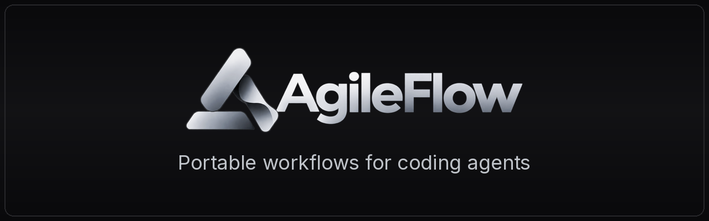

<p align="center">
  
</p>

[](https://www.npmjs.com/package/agileflow)

# AgileFlow

**Portable workflows for coding agents.**

Install a skill once. Use it with Codex, Claude, Cursor, OpenCode, Gemini, and the tools built on top of them.

Small, versioned workflows. No agent runtime. No repository takeover. Build your own toolbox instead of installing 500 prompts.

Documentation: https://docs.agileflow.projectquestorg.com

---

## Quick start

```bash
npm install -g agileflow
cd my-project
agileflow init

# Add individual workflows
agileflow add diagnosing-bugs
agileflow add filing-pr

# Keep them current
agileflow update
```

Then open Codex, Claude, Cursor, OpenCode, or Gemini as usual. That's the important part: AgileFlow is not involved while your agent works. No hook runs, no AgileFlow process starts, no AgileFlow agent is spawned.

## What AgileFlow is

AgileFlow is a **skill manager, compatibility layer, and evaluation system** for coding agents. It installs standard [Agent Skills](https://agentskills.io) (`SKILL.md` files), keeps them versioned and updatable, makes them visible to every provider you use, and lets you customize them without fighting updates.

It is not an agent framework, a multi-agent runtime, a hook runtime, a project-management methodology, or a repository scaffolder. Your coding agent keeps doing the reasoning, planning, delegation, tool use, and permissions.

## What `init` creates

```text
repo/
├── agileflow.yaml          # which skills this repo uses (you edit this)
├── agileflow.lock          # exact resolved versions + hashes (generated)
├── .agents/
│   └── skills/             # canonical skills: standard SKILL.md directories
│       ├── diagnosing-bugs/
│       ├── checking-blast-radius/
│       └── verifying-changes/
└── .claude/
    └── skills/             # only if Claude Code is detected: per-skill links
        ├── diagnosing-bugs -> ../../.agents/skills/diagnosing-bugs
        └── ...
```

That is it. No `docs/` hierarchy, no `.agileflow/` runtime directory, no hooks, no changes to `AGENTS.md`, `CLAUDE.md`, or provider settings. Commit these files to share the workflows with your team.

## Providers

| Provider    | Support      | How it sees the skills                                        |
| ----------- | ------------ | ------------------------------------------------------------- |
| Codex       | native       | reads `.agents/skills` (manual skills get `agents/openai.yaml`) |
| Cursor      | native       | reads `.agents/skills`                                        |
| OpenCode    | native       | reads `.agents/skills`                                        |
| Gemini CLI  | native       | reads `.agents/skills` (manual-only is description-based)     |
| Claude Code | adapted      | per-skill links in `.claude/skills` (marked mirrors if links are unavailable) |
| Grok, Antigravity | experimental | not verified yet                                       |

**T3 Code** and other hosts run these providers, so the providers read the same skills. There is no T3-specific setup.

## Official skills

| Skill                       | Activation | What it does |
| --------------------------- | ---------- | ------------ |
| `diagnosing-bugs`           | auto   | Reproduce, isolate the root cause, make the smallest fix, verify. |
| `checking-blast-radius`     | auto   | Find what a change could break and prove the load-bearing assumptions. |
| `verifying-changes`         | auto   | Smallest meaningful proof that changed behavior works. |
| `reviewing-changes`         | auto   | Review the actual diff for correctness, regressions, scope, security. |
| `filing-pr`                 | auto   | Open a PR with a problem-first description and verification evidence. |
| `babysitting-pr`            | auto   | Drive a PR through CI and review feedback to a defined done state. |
| `resolving-conflicts`       | auto   | Resolve merge/rebase conflicts by intent, then verify. |
| `interviewing-requirements` | manual | Ask a few high-value questions before building (only when asked). |
| `simplifying-explanations`  | manual | Re-explain something at a simpler level (only when asked). |

Packs are named collections: `core` (the first four), `github` (PR workflows), `communication` (the manual skills). `agileflow init --yes` installs `core`.

Skills also come from anywhere else:

```bash
agileflow add @agileflow/github                                  # a pack
agileflow add git+https://github.com/example/skills.git#skills/x # a git repository
agileflow add ./skills/my-release-flow                           # a local directory
```

Before installing third-party content, `add` shows the source, files, executable scripts, and requirements. Scripts are never run during installation.

## Commands

Everyday: `init`, `add`, `remove`, `list`, `sync`, `update`, `check`, `configure`
Power users: `fork`, `diff`, `migrate`, `eval`

| Command | Meaning |
| ------- | ------- |
| `agileflow sync` | Make the filesystem match `agileflow.lock`. No version changes. Run after `git clone`, `git pull`, or switching branches. Works offline from the package cache. |
| `agileflow update` | Resolve newer versions allowed by `agileflow.yaml`, update the lockfile, and sync. |
| `agileflow check` | Report configuration, skill, and provider problems. `--fix` repairs only AgileFlow-owned artifacts; `--verbose` adds paths, link types, and versions. |
| `agileflow remove <skill>` | Remove a skill AgileFlow manages. Unknown skills are never touched. `remove --all` stops using AgileFlow and keeps your skills working. |

Add `--global` to work with personal skills in `~/.agents/skills` (config in `~/.config/agileflow/`).

## Updates, customization, and forks

Every managed skill is recorded in `agileflow.lock` with the hash of what was installed. If you edit a managed skill and a new version arrives, AgileFlow never overwrites your change. It asks:

```text
diagnosing-bugs has local modifications.
Upstream:
  1.0.0 -> 1.1.0
Choose:
  Fork   keep your customized skill and stop tracking upstream
  Reset  discard local edits and install 1.1.0
  Skip   leave this skill unchanged for now
  Diff   compare your copy with the installed base and new upstream
```

In CI, `agileflow update --non-interactive` skips modified skills and exits with status 3.

`agileflow fork <skill>` makes a skill yours permanently. `agileflow diff <skill> --upstream` shows what changed upstream since you forked.

## Configuration

```yaml
# agileflow.yaml
version: 1
skills:
  diagnosing-bugs:
    source: "@agileflow/diagnosing-bugs"
    version: "^1"
  interviewing-requirements:
    source: "@agileflow/interviewing-requirements"
    version: "^1"
    activation: manual
providers:
  claude:
    enabled: auto
  codex:
    enabled: auto
    structuredQuestions: inherit
interaction:
  questionPreference: provider-default   # or: prefer, minimize
```

`agileflow configure` changes skills (enabled, automatic or manual activation), providers, and defaults without editing files. AgileFlow never changes provider permissions, sandbox, model, or effort settings. The only provider setting it can change is Codex's optional Default-mode structured questions, and only when you ask. It records the previous value so it can be restored exactly.

## Zero lock-in

Everything AgileFlow installs is a standard `SKILL.md` in a provider-native location. Uninstall the CLI and your skills keep working. `agileflow remove --all` removes AgileFlow's files and leaves the skills as standalone Agent Skills.

## Migrating from v4

```bash
agileflow migrate v4 --preview   # report only
agileflow migrate v4             # apply (backs up everything it changes)
```

Migration removes AgileFlow-owned hooks, generated mirrors, and runtime files only when ownership can be proven. Your own hooks, skills, learnings, and docs stay. Legacy `docs/` directories are never deleted (`--report-docs` lists them). Codex `approval_policy`/`sandbox_mode` values that v4 may have written are reported, not guessed back.

## Evals

Every official skill ships with at least three eval scenarios, including one that must not trigger the skill.

```bash
agileflow eval --catalog skills --lint                  # structural release gate
agileflow eval diagnosing-bugs --provider claude        # real activation evals
agileflow eval --catalog skills --provider codex --mode full   # behavior + rubric judging
```

## Exit codes

`0` success, `1` error or problems found by `check`, `3` `update --non-interactive` skipped skills with local modifications.

## Developing AgileFlow

```text
apps/cli/            the agileflow CLI (TypeScript, bundled with esbuild)
packages/core/       config, lockfile, skills, installer, updater, ownership, diagnostics, migration
packages/providers/  provider adapters (Codex, Claude, Cursor, OpenCode, Gemini)
packages/registry/   static registry client, git/path sources, integrity, registry builder
packages/evals/      eval scenarios, lint (release gate), provider drivers, runner
skills/              official skills (source of the registry)
packs/               official packs
registry/            generated static registry (served over HTTPS)
schemas/             JSON schemas generated from the validators
fixtures/            test and eval fixture repositories, golden trees
```

```bash
npm install --legacy-peer-deps
npm run typecheck && npm test          # unit + integration tests
npm run test:conformance               # real provider binaries (opt-in)
npm run registry:build                 # after changing skills/ or packs/
npm run release-gate                   # everything CI checks before publishing
```

See [ARCHITECTURE.md](ARCHITECTURE.md) for the design rules.

## License

MIT
