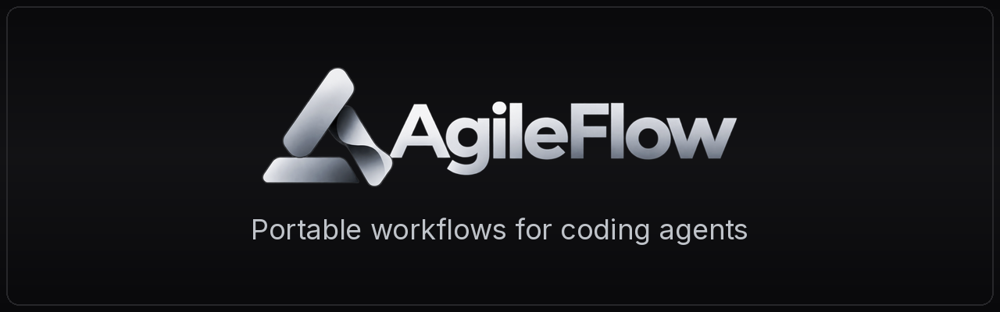

<p align="center">
  
</p>

[](https://www.npmjs.com/package/agileflow)

# AgileFlow

**Portable workflows for coding agents.**

Install a skill once. Use it with Codex, Claude, Cursor, OpenCode, Gemini, and the tools built on top of them.

Small, versioned workflows. No agent runtime. No repository takeover. Build your own toolbox instead of installing 500 prompts.

Documentation: https://docs.agileflow.projectquestorg.com

---

## Quick start

```bash
npm install -g agileflow@next     # v5 is on the `next` tag until 5.0.0 is released
cd my-project
agileflow init

# Add individual workflows
agileflow add diagnosing-bugs
agileflow add filing-pr

# Find more (official catalog + skills.sh), preview, then install
agileflow search pdf
agileflow info anthropics/skills/pdf
agileflow add anthropics/skills/pdf

# Keep them current, and verify what you run
agileflow update
agileflow verify
```

Then open Codex, Claude, Cursor, OpenCode, or Gemini as usual. That's the important part: AgileFlow is not involved while your agent works. No hook runs, no AgileFlow process starts, no AgileFlow agent is spawned.

## What AgileFlow is

AgileFlow is a **skill manager, compatibility layer, and evaluation system** for coding agents. It installs standard [Agent Skills](https://agentskills.io) (`SKILL.md` files), keeps them versioned and updatable, makes them visible to every provider you use, and lets you customize them without fighting updates.

It is not an agent framework, a multi-agent runtime, a hook runtime, or a repository scaffolder. Your coding agent keeps doing the reasoning, planning, delegation, tool use, and permissions.

When you want it, **AgileFlow Work** adds the Agile layer: product, roadmap, epics, stories, and decisions as plain Markdown in one opt-in directory (see [Agile Work](#agile-work)).

## What `init` creates

```text
repo/
├── agileflow.yaml          # which skills this repo uses (you edit this)
├── agileflow.lock          # exact resolved versions + hashes (generated)
├── .agents/
│   └── skills/             # canonical skills: standard SKILL.md directories
│       ├── diagnosing-bugs/
│       ├── checking-blast-radius/
│       └── verifying-changes/
└── .claude/
    └── skills/             # only if Claude Code is detected: per-skill links
        ├── diagnosing-bugs -> ../../.agents/skills/diagnosing-bugs
        └── ...
```

That is it. No `docs/` hierarchy (Agile Work is opt-in), no `.agileflow/` runtime directory, no hooks, no changes to `AGENTS.md`, `CLAUDE.md`, or provider settings. Commit these files to share the workflows with your team.

## Agile Work

```text
AgileFlow
├── Context   What is this repository?          AGENTS.md, CLAUDE.md, docs, code, tests
├── Work      What are we building?             AgileFlow Work
└── Skills    How should the agent do the work? Agent Skills
```

`agileflow work init` enables Work and creates one directory (default `docs/agile`, `--root` to change it):

```text
docs/agile/
├── README.md
├── 00-product/product.md      # problem, users, principles, Definition of Done
├── 01-roadmap/roadmap.md      # now / next / later
├── 02-epics/                  # EPIC-7M4K2P9Q-social-authentication.md
├── 03-stories/                # STORY-3Q7MX2PK-google-sign-in.md
└── 04-decisions/              # DEC-4C8M2Q7K-auth-provider.md
```

Only those five categories. Epics, stories, and decisions are Markdown with a small YAML frontmatter (`schema`, `type`, `id`, `title`, `status`, plus `priority`, `horizon`, `epic`, `depends_on`, `related` where they apply). The story file is the source of truth: there is no `status.json`, no generated board file, no index, and no sequential counter. IDs are 8 random Crockford Base32 characters, so parallel branches, worktrees, and agents create them without coordinating (`check` reports a duplicate if one ever happens).

```bash
agileflow work new epic --title "Social authentication" --horizon now
agileflow work new story --epic 7M4K --title "Add Google sign-in"   # IDs accept unique prefixes
agileflow work new story --title "Fix duplicate invoice email"      # standalone: no epic needed
agileflow work list --status ready
agileflow work show 3Q7M                                            # derived: epic, dependencies, criteria progress
agileflow work status 3Q7M in-progress                              # changes only the status line
agileflow work board                                                # computed from frontmatter, never written
```

Every command takes `--json`; `agileflow work list --ready --json` gives agent orchestrators the stories that can start now, and `agileflow work import v4` converts a v4 backlog. `agileflow check` validates the workspace: duplicate IDs, unknown epics and dependencies, dependency cycles, done epics with unfinished stories, and done stories with unchecked acceptance criteria.

`work init` also offers the `agile` pack: `creating-epics`, `writing-stories`, `working-story` (take a ready story through implementation and verification), `reviewing-story` (check each acceptance criterion; refuse to close a story that is not delivered), and `recording-decisions`. `filing-pr` and `babysitting-pr` pick up the story when there is one. No sprints, points, assignees, or ceremonies.

## Providers

| Provider    | Support      | How it sees the skills                                        |
| ----------- | ------------ | ------------------------------------------------------------- |
| Codex       | native       | reads `.agents/skills` (manual skills get `agents/openai.yaml`) |
| Cursor      | native       | reads `.agents/skills`                                        |
| OpenCode    | native       | reads `.agents/skills` (manual-only is description-based)     |
| Gemini CLI  | native       | reads `.agents/skills` (manual-only is description-based)     |
| Claude Code | adapted      | per-skill links in `.claude/skills` (marked mirrors if links are unavailable) |
| Any other agent | custom     | `providers.<id>.skillsDir` in `agileflow.yaml` links skills into its directory |
| Grok, Antigravity | experimental | not verified yet                                       |

**T3 Code** and other hosts run these providers, so the providers read the same skills. There is no T3-specific setup.

## Official skills

| Skill                       | Activation | What it does |
| --------------------------- | ---------- | ------------ |
| `diagnosing-bugs`           | auto   | Reproduce, isolate the root cause, make the smallest fix, verify. |
| `checking-blast-radius`     | auto   | Find what a change could break and prove the load-bearing assumptions. |
| `verifying-changes`         | auto   | Smallest meaningful proof that changed behavior works. |
| `reviewing-changes`         | auto   | Review the actual diff for correctness, regressions, scope, security. |
| `filing-pr`                 | auto   | Open a PR with a problem-first description and verification evidence. |
| `babysitting-pr`            | auto   | Drive a PR through CI and review feedback to a defined done state. |
| `resolving-conflicts`       | auto   | Resolve merge/rebase conflicts by intent, then verify. |
| `interviewing-requirements` | manual | Ask a few high-value questions before building (only when asked). |
| `simplifying-explanations`  | manual | Re-explain something at a simpler level (only when asked). |
| `creating-epics`            | auto   | Create or refine an outcome-level epic (Agile Work). |
| `writing-stories`           | auto   | Break an epic into vertical-slice stories with acceptance criteria. |
| `working-story`             | auto   | Implement a story from its acceptance criteria through verification. |
| `reviewing-story`           | auto   | Check an implementation against its story, criterion by criterion. |
| `recording-decisions`       | auto   | Record a decision (context, decision, consequences) in Work or your ADR directory. |

Packs are named collections: `core` (the first four plus `resolving-conflicts`), `github` (PR workflows, need `gh`), `communication` (the manual skills), `agile` (the Agile Work skills). `agileflow init --yes` installs `core`; `agileflow work init` offers `agile`.

Skills also come from anywhere else:

```bash
agileflow add @agileflow/github                                  # a pack
agileflow add anthropics/skills/pdf                              # GitHub (skills.sh ids), pinned to a commit
agileflow add owner/repo@v1.2.0 --skill release-notes            # a tag, one skill of a collection
agileflow add git+https://github.com/example/skills.git#skills/x # any git repository
agileflow add ./skills/my-release-flow                           # a local directory
```

Before installing third-party content, `add` shows the source, files, executable scripts, requirements, and a content scan (download-and-run commands, destructive commands, credential access, prompt-injection phrasing, hidden text). Without a terminal, third-party installs need `--yes`. Scripts are never run during installation. `agileflow create my-skill` scaffolds your own skill with evals.

## Trust and verification

- Official packages are verified against integrities pinned into each CLI release, and every official bundle has a GitHub build attestation (`agileflow verify --attestations`). The CLI itself is published with npm provenance.
- `agileflow verify` re-checks every locked package, the installed files, and the content; `--fail-on high` makes it a CI gate. Or use the GitHub Action:

```yaml
- uses: projectquestorg/AgileFlow@main
  with:
    fail-on: high
```

- `update` shows the diff and scan of third-party changes and applies them only with your approval (`--yes` in CI). `agileflow history` shows what changed and what you approved.
- Registries must be HTTPS; git sources use https/ssh; refs from a cloned repository cannot inject git options.

## Commands

Everyday: `init`, `search`, `info`, `add`, `remove`, `list`, `sync`, `update`, `check` (alias `doctor`), `configure`, `work`
Power users: `verify` (`--sbom`), `fork`, `diff`, `create`, `history`, `registry` (private team registries), `migrate`, `eval`, `completion`, `self-update`

Every command has `--help` and `--json`; changing commands have `--dry-run`. Global flags: `--offline` (work from the cache), `--debug`, `--no-color`.

| Command | Meaning |
| ------- | ------- |
| `agileflow sync` | Make the filesystem match `agileflow.lock`. No version changes. Run after `git clone`, `git pull`, or switching branches. Works offline from the package cache. |
| `agileflow update` | Resolve newer versions allowed by `agileflow.yaml`, update the lockfile, and sync. |
| `agileflow check` | Report configuration, skill, and provider problems. `--fix` repairs only AgileFlow-owned artifacts; `--verbose` adds paths, link types, and versions. |
| `agileflow work <init\|new\|list\|show\|status\|board>` | Opt-in Agile Work: epics, stories, and decisions as Markdown. See [Agile Work](#agile-work). |
| `agileflow remove <skill>` | Remove a skill AgileFlow manages. Unknown skills are never touched. `remove --all` stops using AgileFlow and keeps your skills working. |

Add `--global` to work with personal skills in `~/.agents/skills` (config in `~/.config/agileflow/`).

## Updates, customization, and forks

Every managed skill is recorded in `agileflow.lock` with the hash of what was installed. If you edit a managed skill and a new version arrives, AgileFlow never overwrites your change. It asks:

```text
diagnosing-bugs has local modifications.
Upstream:
  1.0.0 -> 1.1.0
Choose:
  Fork   keep your customized skill and stop tracking upstream
  Reset  discard local edits and install 1.1.0
  Skip   leave this skill unchanged for now
  Diff   compare your copy with the installed base and new upstream
```

In CI, `agileflow update --non-interactive` skips modified skills (and third-party changes you have not approved with `--yes`) and exits with status 3.

`agileflow fork <skill>` makes a skill yours permanently. `agileflow diff <skill> --upstream` shows what changed upstream since you forked.

## Configuration

```yaml
# agileflow.yaml
version: 1
skills:
  diagnosing-bugs:
    source: "@agileflow/diagnosing-bugs"
    version: "^1"
  interviewing-requirements:
    source: "@agileflow/interviewing-requirements"
    version: "^1"
    activation: manual
providers:
  claude:
    enabled: auto
  codex:
    enabled: auto
    structuredQuestions: inherit
  windsurf:                              # any other agent: link skills into its directory
    skillsDir: .windsurf/skills
interaction:
  questionPreference: provider-default   # or: prefer, minimize
agileflow: ">=5.0.0"                     # optional: the CLI versions this project needs
work:                                    # only after `agileflow work init`
  enabled: true
  root: docs/agile
```

`agileflow configure` changes skills (enabled, automatic or manual activation), providers, and defaults without editing files. `questionPreference: prefer` makes skills with real decision points ask before choosing between materially different options (native question UI when available, plain text otherwise); `minimize` makes them assume, keep going, and state consequential assumptions. Skills whose purpose is asking still ask under `minimize`. AgileFlow never changes provider permissions, sandbox, model, or effort settings. The only provider setting it can change is Codex's optional Default-mode structured questions, and only when you ask. It records the previous value so it can be restored exactly.

## Zero lock-in

Everything AgileFlow installs is a standard `SKILL.md` in a provider-native location. Uninstall the CLI and your skills keep working. `agileflow remove --all` removes AgileFlow's files and leaves the skills as standalone Agent Skills.

## Migrating from v4

```bash
agileflow migrate v4 --preview   # report only
agileflow migrate v4             # apply (backs up everything it changes)
agileflow migrate v4 --global    # a personal v4 install in your home directory
```

Migration removes AgileFlow-owned hooks, generated mirrors, and runtime files only when ownership can be proven. Your own hooks, skills, learnings, and docs stay. Legacy `docs/` directories are never deleted (`--report-docs` lists them). Codex `approval_policy`/`sandbox_mode` values that v4 may have written are reported, not guessed back.

## Evals

Every official skill ships with at least three eval scenarios, including one that must not trigger the skill.

```bash
agileflow eval --catalog skills --lint                  # structural release gate
agileflow eval diagnosing-bugs --provider claude        # real activation evals
agileflow eval --catalog skills --provider codex --mode full   # behavior + rubric judging
agileflow eval --catalog skills --provider claude,codex --runs 3 # precision/recall per provider, 95% intervals
```

Providers run in sandboxes with an isolated HOME (only their login files are copied in), so your personal skills never skew results. Adversarial scenarios check that a skill does not follow injected instructions.

## Exit codes

`0` success, `1` error or problems found by `check`/`verify`, `3` a non-interactive `update` skipped skills that need a decision. Never `2`.

## Developing AgileFlow

```text
apps/cli/            the agileflow CLI (TypeScript, bundled with esbuild)
packages/core/       config, lockfile, skills, installer, updater, ownership, diagnostics, migration
packages/providers/  provider adapters (Codex, Claude, Cursor, OpenCode, Gemini)
packages/registry/   static registry client, git/path sources, integrity, registry builder
packages/evals/      eval scenarios, lint (release gate), provider drivers, runner
packages/work/       Agile Work: artifacts, IDs, frontmatter, queries, lifecycle, validation
skills/              official skills (source of the registry)
packs/               official packs
registry/            generated static registry (served over HTTPS)
schemas/             JSON schemas generated from the validators (schemas/work/ for Work artifacts)
fixtures/            test and eval fixture repositories, golden trees
assets/brand/        logo, palette, and the asset generator
apps/website/        agileflow website
apps/docs/           documentation site
```

```bash
npm install --legacy-peer-deps
npm run typecheck && npm test          # unit + integration tests
npm run test:conformance               # real provider binaries (opt-in)
npm run registry:build                 # after changing skills/ or packs/
npm run release-gate                   # everything CI checks before publishing
```

See [ARCHITECTURE.md](ARCHITECTURE.md) for the design rules.

## License

MIT
