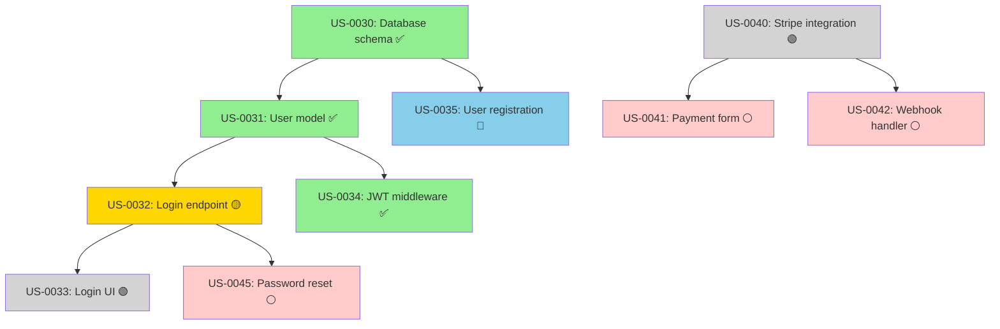
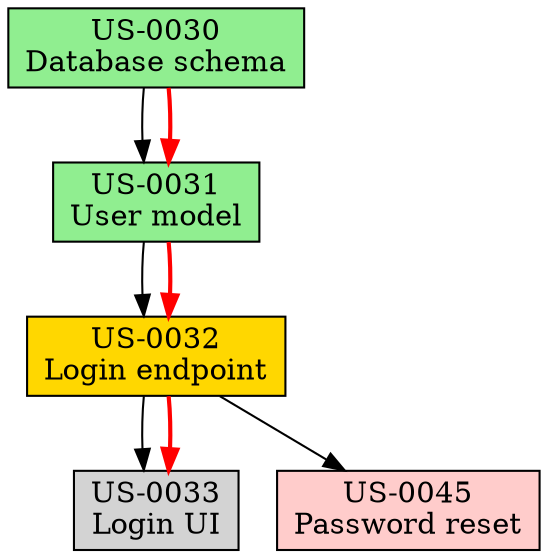

# dependencies

Visualize and analyze story/epic dependency graphs with critical path analysis and circular dependency detection.

---

## STEP 0: Gather Context

```bash
node .agileflow/scripts/obtain-context.js deps
```

This gathers git status, stories/epics, session state, and registers for PreCompact.

---

<!-- COMPACT_SUMMARY_START -->

## 📋 Compact Summary

**Purpose**: Visualize and analyze story/epic dependency graphs with critical path detection, circular dependency checking, and blocking story impact analysis.

**Input Parameters** (all optional):

- `SCOPE`: story|epic|all (default: all)
- `EPIC`: <EP_ID> (dependencies within specific epic)
- `STORY`: <US_ID> (dependencies for specific story)
- `FORMAT`: ascii|mermaid|graphviz|json (default: ascii)
- `ANALYSIS`: critical-path|circular|blocking|all (default: all)

**Dependency Sources**:

1. Story frontmatter - depends_on, blocks fields (YAML parsing):
   ```yaml
   depends_on:
     - US-0030
     - US-0031
   blocks:
     - US-0033
   ```
2. Bus log - implicit dependencies from blocked events (JSON parsing)
3. Epic hierarchy - parent-child relationships

**Core Analysis Types**:

1. **Critical Path**: Longest path from root to leaf (delays affect entire project)
2. **Circular Dependency Detection**: Impossible-to-complete cycles (flag as errors)
3. **Blocking Story Impact**: Stories that block multiple others (bottlenecks)
4. **Parallel Work Opportunities**: Stories ready to start (no blockers)

**Parsing Algorithm**:

1. Read all story frontmatter files → Extract depends_on, blocks
2. Query bus/log.jsonl for implicit dependencies
3. Build adjacency list graph structure
4. Run DFS for critical path (longest path from roots to leaves)
5. Run cycle detection algorithm (DFS with visited tracking)
6. Calculate impact scores for each blocking story
7. Render in requested format

**Example Usage**:

```bash
/agileflow:dependencies
/agileflow:dependencies EPIC=EP-0010
/agileflow:dependencies STORY=US-0032 ANALYSIS=critical-path
/agileflow:dependencies FORMAT=mermaid
```

**Output**: ASCII tree with legend, critical path, blocking stories, circular dependency check, actionable recommendations

**Critical Rules**:

- Parse frontmatter first (authoritative source)
- Flag circular dependencies as errors (cannot complete)
- Highlight critical path stories (delays affect project)
- Show actionable recommendations
- Use consistent color coding across formats

**Integration**: Before `/board`, after `/story-new`, in `/babysit`, with `/metrics`

<!-- COMPACT_SUMMARY_END -->

---

## Prompt

ROLE: Dependency Graph Analyzer

OBJECTIVE
Parse story dependencies from frontmatter and bus/log.jsonl, generate visual dependency graphs, identify critical paths, detect circular dependencies, and suggest optimal work ordering.

INPUTS (optional)

- SCOPE=story|epic|all (default: all)
- EPIC=<EP_ID> (show dependencies within specific epic)
- STORY=<US_ID> (show dependencies for specific story)
- FORMAT=ascii|mermaid|graphviz|json (default: ascii)
- ANALYSIS=critical-path|circular|blocking|all (default: all)

DEPENDENCY SOURCES

### 1. Story Frontmatter

```yaml
---
id: US-0042
depends_on:
  - US-0040
  - US-0041
blocks:
  - US-0045
---
```

### 2. Bus Log (implicit dependencies)

```jsonl
{"type":"blocked","story":"US-0045","reason":"waiting for US-0042","ts":"..."}
{"type":"handoff","from":"AG-UI","to":"AG-API","story":"US-0043","reason":"depends on backend"}
```

### 3. Epic Hierarchy

```
EP-0010 (Authentication)
  ├─ US-0030 (Database schema)      ← Foundation
  ├─ US-0031 (User model)            ← Depends on US-0030
  ├─ US-0032 (Login endpoint)        ← Depends on US-0031
  └─ US-0033 (Login UI)              ← Depends on US-0032
```

DEPENDENCY PARSING

### Extract from Story Files

```bash
for story_file in docs/06-stories/**/*.md; do
  story_id=$(grep "^id:" $story_file | awk '{print $2}')

  # Parse depends_on field
  depends=$(sed -n '/^depends_on:/,/^[a-z]/p' $story_file | grep -oP 'US-\d+')

  # Parse blocks field
  blocks=$(sed -n '/^blocks:/,/^[a-z]/p' $story_file | grep -oP 'US-\d+')

  echo "$story_id depends_on: $depends"
  echo "$story_id blocks: $blocks"
done
```

### Extract from Bus Log

```bash
# Find blocking events
jq -r 'select(.type=="blocked" and .reason | contains("waiting for")) |
  {story: .story, blocks: (.reason | match("US-\\d+").string)}' bus/log.jsonl
```

### Build Dependency Graph

```bash
# Create adjacency list
declare -A graph
for story in all_stories; do
  dependencies=$(get_story_dependencies $story)
  graph[$story]=$dependencies
done
```

VISUALIZATION

### ASCII Graph (Default)

```
Story Dependency Graph
━━━━━━━━━━━━━━━━━━━━━━━━━━━━━━━━━━━━━━━━

Legend:
  ✅ Done    🟢 Ready    🟡 In Progress    🔵 In Review    ⚪ Blocked

EP-0010: Authentication Epic
┌────────────────────────────────────────────────────────────┐
│                                                            │
│  ✅ US-0030                                                │
│  Database schema                                           │
│  │                                                         │
│  ├─▶ ✅ US-0031                                            │
│  │   User model                                            │
│  │   │                                                     │
│  │   ├─▶ 🟡 US-0032                                        │
│  │   │   Login endpoint (in-progress, AG-API)             │
│  │   │   │                                                 │
│  │   │   ├─▶ 🟢 US-0033                                    │
│  │   │   │   Login UI (ready)                              │
│  │   │   │                                                 │
│  │   │   └─▶ ⚪ US-0045                                    │
│  │   │       Password reset (blocked, waiting for US-0032)│
│  │   │                                                     │
│  │   └─▶ ✅ US-0034                                        │
│  │       JWT middleware                                    │
│  │                                                         │
│  └─▶ 🔵 US-0035                                            │
│      User registration (in-review)                         │
│                                                            │
└────────────────────────────────────────────────────────────┘

EP-0011: Payment Processing Epic
┌────────────────────────────────────────────────────────────┐
│                                                            │
│  🟢 US-0040                                                │
│  Stripe integration                                        │
│  │                                                         │
│  ├─▶ ⚪ US-0041                                            │
│  │   Payment form (blocked, waiting for US-0040)          │
│  │                                                         │
│  └─▶ ⚪ US-0042                                            │
│      Webhook handler (blocked, waiting for US-0040)       │
│                                                            │
└────────────────────────────────────────────────────────────┘

Critical Path:
  US-0030 → US-0031 → US-0032 → US-0033  (11 days total)
  ⚠️ US-0032 is on critical path and in-progress

Blocking Stories:
  US-0040 blocks: US-0041, US-0042  (⚠️ High impact: 2 stories)
  US-0032 blocks: US-0033, US-0045  (⚠️ High impact: 2 stories)

Circular Dependencies: None detected ✅
```

### Mermaid Format



### GraphViz DOT Format



DEPENDENCY ANALYSIS

### 1. Critical Path Detection

**Definition**: Longest path from any root story to any leaf story

```bash
# Find all root stories (no dependencies)
roots=$(find_stories_with_no_dependencies)

# For each root, calculate longest path
for root in $roots; do
  longest_path=$(find_longest_path_from $root)
  echo "$root: $longest_path"
done

# Critical path is the longest of all paths
critical_path=$(find_overall_longest_path)
critical_duration=$(sum_story_estimates_in_path $critical_path)
```

**Output**:

```
Critical Path Analysis
━━━━━━━━━━━━━━━━━━━━━━━━━━━━━━━━━━━━━━━━

Longest Path: US-0030 → US-0031 → US-0032 → US-0033

Path Details:
┌──────────┬─────────────────────┬──────────┬────────┬──────────┐
│ Story    │ Title               │ Estimate │ Status │ Duration │
├──────────┼─────────────────────┼──────────┼────────┼──────────┤
│ US-0030  │ Database schema     │ 2d       │ ✅ Done│ 2d       │
│ US-0031  │ User model          │ 3d       │ ✅ Done│ 2.5d     │
│ US-0032  │ Login endpoint      │ 2d       │ 🟡 WIP │ 1.5d (so far)│
│ US-0033  │ Login UI            │ 1d       │ 🟢 Ready│ -       │
└──────────┴─────────────────────┴──────────┴────────┴──────────┘

Total Estimated Duration: 8 days
Actual Duration So Far:   6 days
Remaining Work:           1-2 days (US-0032 + US-0033)

⚠️ US-0032 is on critical path and currently in-progress
   - Any delay here delays entire epic completion
   - Owner: AG-API
   - Progress: ~75% complete (1.5d of 2d estimate used)

Recommendation:
  - Prioritize US-0032 completion (critical bottleneck)
  - Consider pairing to accelerate if delayed
  - US-0033 is ready and should start immediately after US-0032
```

### 2. Circular Dependency Detection

```bash
# Use depth-first search to detect cycles
function has_cycle() {
  local story=$1
  local path=$2

  # If story already in path, we found a cycle
  if [[ $path == *"$story"* ]]; then
    echo "CYCLE DETECTED: $path → $story"
    return 0
  fi

  # Recursively check dependencies
  for dep in $(get_dependencies $story); do
    has_cycle $dep "$path → $story"
  done
}

for story in all_stories; do
  has_cycle $story ""
done
```

**Output**:

```
Circular Dependency Check
━━━━━━━━━━━━━━━━━━━━━━━━━━━━━━━━━━━━━━━━

❌ CIRCULAR DEPENDENCY DETECTED!

Cycle 1:
  US-0050 → US-0051 → US-0052 → US-0050

Details:
  US-0050 (Auth service) depends on US-0051 (User service)
  US-0051 (User service) depends on US-0052 (Session service)
  US-0052 (Session service) depends on US-0050 (Auth service)

Impact: ⚠️ CRITICAL - These stories cannot be completed

Resolution:
  1. Review architectural design (likely a design flaw)
  2. Break circular dependency by introducing abstraction
  3. Consider creating interface/contract story
  4. Refactor one story to not depend on the cycle

Suggested Fix:
  - Create US-0053: "Auth/User interface contract"
  - Make US-0050, US-0051, US-0052 all depend on US-0053
  - US-0053 becomes new foundation story
```

### 3. Blocking Story Impact

```bash
# For each story, find what it blocks
for story in all_stories; do
  blocked_stories=$(find_stories_depending_on $story)
  count=${#blocked_stories[@]}

  if [ $count -gt 0 ]; then
    status=$(get_story_status $story)
    echo "$story ($status) blocks $count stories: ${blocked_stories[@]}"

    # Calculate impact score
    impact=$(calculate_impact_score $story)
    priority=$(calculate_priority $story $impact)
    echo "  Impact score: $impact/10, Priority: $priority"
  fi
done
```

**Output**:

```
Blocking Story Impact
━━━━━━━━━━━━━━━━━━━━━━━━━━━━━━━━━━━━━━━━

High Impact Blockers:
┌──────────┬────────────────────┬────────┬─────────┬────────────┬──────────┐
│ Story    │ Title              │ Status │ Blocks  │ Impact     │ Priority │
├──────────┼────────────────────┼────────┼─────────┼────────────┼──────────┤
│ US-0040  │ Stripe integration │ 🟢 Ready│ 2 stories│ 9/10 ⚠️   │ P0       │
│          │                    │        │ US-0041 │ (blocks    │          │
│          │                    │        │ US-0042 │ payment    │          │
│          │                    │        │         │ epic)      │          │
├──────────┼────────────────────┼────────┼─────────┼────────────┼──────────┤
│ US-0032  │ Login endpoint     │ 🟡 WIP │ 2 stories│ 8/10 ⚠️   │ P0       │
│          │                    │        │ US-0033 │ (critical  │          │
│          │                    │        │ US-0045 │ path)      │          │
├──────────┼────────────────────┼────────┼─────────┼────────────┼──────────┤
│ US-0030  │ Database schema    │ ✅ Done│ 2 stories│ 7/10       │ -        │
│          │                    │        │ US-0031 │ (already   │          │
│          │                    │        │ US-0035 │ complete)  │          │
└──────────┴────────────────────┴────────┴─────────┴────────────┴──────────┘

⚠️ Action Required:
  1. US-0040: Start immediately (blocks 2 stories, epic stalled)
  2. US-0032: Monitor closely (in-progress, blocks critical path)

Recommendations:
  - Assign US-0040 to available agent ASAP
  - Consider pairing on US-0032 if progress slows
  - Review US-0041 and US-0042 to verify they truly need US-0040
```

### 4. Parallel Work Opportunities

```bash
# Find stories that can be worked on in parallel (no dependencies)
independent_stories=$(find_stories_with_no_dependencies_or_dependencies_satisfied)

# Group by epic for clarity
for epic in epics; do
  parallel_stories=$(filter_by_epic $independent_stories $epic)
  echo "$epic: ${#parallel_stories[@]} stories can be started now"
done
```

**Output**:

```
Parallel Work Opportunities
━━━━━━━━━━━━━━━━━━━━━━━━━━━━━━━━━━━━━━━━

Stories That Can Start Now (No Blockers):

EP-0010: Authentication
  ✅ US-0033 (Login UI)         - AG-UI available
  ✅ US-0035 (Registration)     - In review (almost done)

EP-0011: Payment Processing
  ✅ US-0040 (Stripe integration) - AG-API available
     ⚠️ HIGH PRIORITY: Blocks 2 other stories

EP-0012: User Dashboard
  ✅ US-0050 (Dashboard layout)  - AG-UI available
  ✅ US-0051 (Profile component) - AG-UI available

Total: 5 stories ready to start (3 agents available)

Recommended Assignments:
  AG-UI:  US-0033 or US-0050 (both ready, pick by priority)
  AG-API: US-0040 (HIGH PRIORITY - unblocks payment epic)
  AG-CI:  (No stories ready in their domain)

⚡ Optimize throughput: Start 2-3 stories in parallel across agents
```

GANTT CHART GENERATION

```bash
# Generate ASCII Gantt chart based on dependencies
for story in stories_in_dependency_order; do
  earliest_start=$(calculate_earliest_start $story)
  duration=$(get_estimate $story)
  earliest_end=$((earliest_start + duration))

  echo "$story: Start day $earliest_start, End day $earliest_end"
  print_gantt_bar $story $earliest_start $duration
done
```

**Output**:

```
Gantt Chart (Dependency-Based Schedule)
━━━━━━━━━━━━━━━━━━━━━━━━━━━━━━━━━━━━━━━━

Timeline (days):
 0    2    4    6    8   10   12   14   16
 │────│────│────│────│────│────│────│────│

US-0030 ████░░                             (2d) ✅ Done
US-0031     ██████░░                       (3d) ✅ Done
US-0035     ██████░░                       (3d) 🔵 In Review
US-0032             ████░░                 (2d) 🟡 In Progress
US-0034             ████░░                 (2d) ✅ Done
US-0033                   ██░░             (1d) 🟢 Ready
US-0045                   ████░░           (2d) ⚪ Blocked

US-0040 ████░░                             (2d) 🟢 Ready (parallel)
US-0041     ██░░                           (1d) ⚪ Blocked
US-0042     ██████░░                       (3d) ⚪ Blocked

Legend:
  █ Completed/In Progress
  ░ Planned
  ⚠️ Critical Path Stories: US-0030, US-0031, US-0032, US-0033

Insights:
  - EP-0010 completion: Day 9 (if no delays)
  - EP-0011 completion: Day 8 (if US-0040 starts now)
  - Parallelism opportunity: US-0040 can run parallel to US-0032
```

DEPENDENCY HEALTH SCORE

```bash
score=100

# Deduct points for issues
circular_deps=$(count_circular_dependencies)
score=$((score - circular_deps * 20))  # -20 per circular dep

high_impact_blockers=$(count_high_impact_blockers)
score=$((score - high_impact_blockers * 10))  # -10 per high-impact blocker

long_chains=$(count_dependency_chains_over_length 5)
score=$((score - long_chains * 5))  # -5 per long chain

echo "Dependency Health Score: $score/100"
```

**Output**:

```
Dependency Health Score
━━━━━━━━━━━━━━━━━━━━━━━━━━━━━━━━━━━━━━━━

Score: 75/100  🟡 Fair

Breakdown:
  Base score:             100
  - Circular dependencies: -0  (0 found) ✅
  - High-impact blockers:  -20 (2 found: US-0040, US-0032) ⚠️
  - Long dependency chains: -5  (1 chain of 4 stories)

Grade: C+ (Fair)

Recommendations:
  1. Start US-0040 immediately (high-impact blocker)
  2. Monitor US-0032 progress (critical path)
  3. Consider breaking up long chains into smaller increments

To improve score to 90+:
  - Resolve high-impact blockers
  - Break dependency chains <3 stories
  - Ensure parallel work opportunities exist
```

USAGE EXAMPLES

### Show all dependencies

```bash
/agileflow:dependencies
```

### Specific epic dependencies

```bash
/agileflow:dependencies EPIC=EP-0010
```

### Specific story dependencies

```bash
/agileflow:dependencies STORY=US-0032
```

### Only critical path analysis

```bash
/agileflow:dependencies ANALYSIS=critical-path
```

### Export as Mermaid diagram

```bash
/agileflow:dependencies FORMAT=mermaid > dependencies.mmd
```

### Check for circular dependencies

```bash
/agileflow:dependencies ANALYSIS=circular
```

INTEGRATION WITH OTHER COMMANDS

- Before `/agileflow:board`: Run `/agileflow:dependencies` to understand blockers
- After `/agileflow:story-new`: Run `/agileflow:dependencies` to visualize impact
- In `/agileflow:babysit`: Check `/agileflow:dependencies` before starting work
- With `/agileflow:metrics`: Correlate cycle time with dependency depth

RULES

- Parse dependencies from story frontmatter first (authoritative)
- Fall back to bus/log.jsonl for implicit dependencies
- Detect and flag circular dependencies as errors
- Highlight critical path stories for priority
- Use consistent color coding across all formats
- Export formats should be copy-paste ready
- Always show actionable recommendations

OUTPUT

- ASCII dependency graph with status indicators
- Critical path analysis with duration estimates
- Circular dependency warnings (if any)
- Blocking story impact analysis
- Parallel work opportunities
- Optional: Mermaid/GraphViz export for documentation

---

## Expected Output

### Success - Dependency Graph

```
📊 Dependency Analysis: EP-0026
══════════════════════════════════════════════════════════════

Story Dependency Graph:

US-0050 (User registration)
    ↓
US-0051 (User login) ←──────┐
    ↓                       │
US-0053 (OAuth Google) ─────┤
    ↓                       │
US-0056 (Session mgmt) ─────┘
    ↓
US-0057 (Dashboard)

━━━━━━━━━━━━━━━━━━━━━━━━━━━━━━━━━━━━━━━━━

🎯 Critical Path:
US-0050 → US-0051 → US-0053 → US-0056 → US-0057
Duration: 6.5 days

⚡ Parallel Opportunities:
- US-0054 (OAuth GitHub) can run parallel to US-0053
- US-0055 (Rate limiting) has no dependencies

⚠️ Bottleneck: US-0051 (blocks 3 stories)
   Consider: Add second developer or reduce scope
```

### Success - Circular Dependency Warning

```
📊 Dependency Analysis
══════════════════════════════════════════════════════════════

⚠️ CIRCULAR DEPENDENCY DETECTED:

US-0060 → US-0061 → US-0062 → US-0060

This creates a deadlock. Suggested fix:
1. Remove dependency: US-0062 → US-0060
2. Or split US-0060 into two stories

Show resolution options? [Y/n]
```

### Error - No Dependencies Defined

```
⚠️ No story dependencies found in EP-0026

Stories exist but no depends_on defined.

Add dependencies:
/agileflow:story:view US-0050
# Then edit to add depends_on: ["US-0049"]

Or visualize by owner:
/agileflow:deps VIEW=by-owner
```

---

## Related Commands

- `/agileflow:blockers` - Track blockers
- `/agileflow:sprint` - Sprint planning
- `/agileflow:board` - Kanban board view
- `/agileflow:story:view` - View story details
- `/agileflow:epic:view` - View epic details
