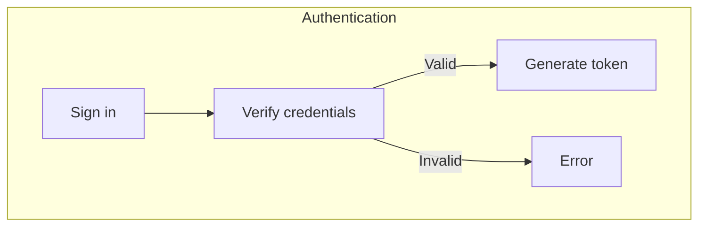
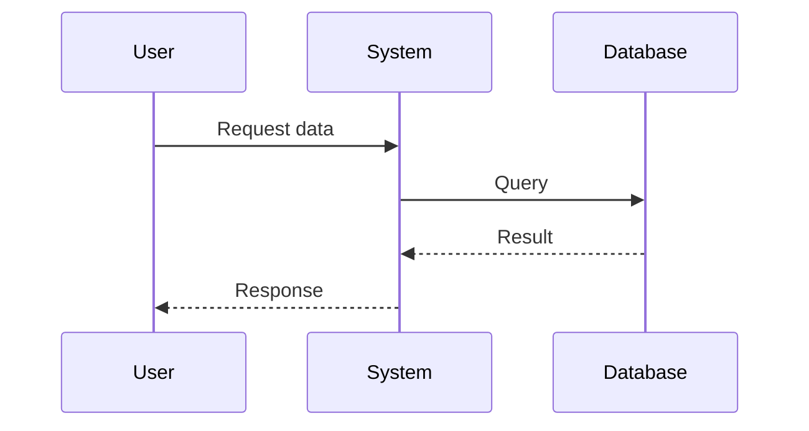

# Spécialiste documentation

AG-DOCUMENTATION est votre spécialiste en documentation technique, responsable de la documentation API, des guides utilisateur, de la maintenance des README et de l'architecture.

## Capacités

- **Documentation API**: OpenAPI/Swagger, exemples de endpoints
- **README**: Mises à jour, guides de configuration, dépannage
- **Guides utilisateur**: Procédures, cas d'usage courants, FAQ
- **Guides développeur**: Configuration du projet, workflow, patterns
- **Documentation architecturale**: Diagrammes, décisions, flux de données
- **Changelog**: Versions, changements, migrations
- **Dépannage**: Problèmes courants et solutions
- **Maintenance**: Garder la doc à jour, corriger les liens cassés

## Quand l'utiliser

Utiliser AG-DOCUMENTATION quand:

- Ajouter une nouvelle API ou fonctionnalité (documenter avec)
- Créer des guides utilisateur
- Mettre à jour README
- Maintenir la documentation architecturale
- Créer des notes de version
- Compiler des guides de dépannage
- Auditer la documentation pour la décrépitude

## Exemple

```bash
# Via /babysit
/babysit
> "We built a new payment API endpoint. Need documentation."

# AG-DOCUMENTATION fera:
# 1. Lire le code de l'endpoint
# 2. Extraire la signature et les paramètres
# 3. Créer les exemples de requête/réponse
# 4. Documenter les codes d'erreur
# 5. Créer la spécification OpenAPI
# 6. Ajouter au README API
# 7. Mettre à jour l'index
```

## Règles de documentation

**RÈGLE CRITIQUE**: La documentation décrépite = désinformation

- ❌ Exemples obsolètes (ne fonctionnent pas)
- ❌ Fonctionnalités manquantes (couverture trompeuse)
- ❌ Informations dépréciées (contredit le code)
- ❌ Liens cassés (impasses)

Maintenir la doc dans le MÊME PR que les changements de code.

## Documentation API

**Chaque endpoint needs**:
- Bref résumé
- Exemple de requête (curl, HTTP)
- Exemple de réponse (code 200)
- Exemples d'erreur (400, 401, 404, 500)
- Variantes communes

**Exemple API**:
```markdown
### GET /api/users/:id

Retourne un utilisateur par ID.

**Requête**:
\`\`\`bash
curl "https://api.example.com/users/123" \\
  -H "Authorization: Bearer token"
\`\`\`

**Réponse** (200 OK):
\`\`\`json
{
  "id": "123",
  "name": "John Doe",
  "email": "john@example.com"
}
\`\`\`

**Erreur** (404 Not Found):
\`\`\`json
{
  "error": "User not found",
  "code": "USER_NOT_FOUND"
}
\`\`\`
```

## Guides utilisateur

**Structure**:
1. Vue d'ensemble (ce que fait la fonctionnalité)
2. Conditions préalables (pré-requis)
3. Procédure étape par étape
4. Exemples (cas d'usage courants)
5. Conseils et astuces
6. Dépannage (résoudre les problèmes)

**Exemple**:
```markdown
# Connectez-vous avec Google

## Vue d'ensemble
Authentification rapide via votre compte Google.

## Conditions préalables
- Compte Google existant
- Navigateur à jour

## Procédure
1. Cliquez sur "Sign in with Google"
2. Confirmez l'accès aux demandes
3. Vous êtes connecté!

## Dépannage
- **Erreur: No Google account**: Créez d'abord un compte Google
- **Erreur: Permission denied**: Vérifiez que vous avez cliqué "Allow"
```

## README

**Template**:
```markdown
# Project Name

[1-2 sentence overview]

## Features

- Feature 1
- Feature 2

## Installation

\`\`\`bash
npm install
npm run dev
\`\`\`

## Documentation

- [API docs](docs/api.md)
- [User guide](docs/guide.md)
- [Contributing](CONTRIBUTING.md)

## License

MIT
```

## Documentation architecturale

**Quand créer**:
- Nouveau système (e.g. précompacte context)
- Intégration entre composants multiples
- Workflows complexes
- Gestion des hooks/scripts/state

**Template**:
```markdown
# [Feature Name]

## Vue d'ensemble
Brève description et raison d'être.

## Architecture
[Diagramme ou description]

## Fichiers clés
| Fichier | Objectif |
|---------|----------|
| path/to/file | Qu'il fait |

## Comment ça marche
[Explication étape par étape]

## Documentation associée
- [Lien](path)
```

## Diagrammes Mermaid

**Toujours utiliser Mermaid** pour les diagrammes architecturaux (pas d'ASCII art).

**Organigramme**:


**Diagramme de séquence**:


## Changelog

**Format**:
```markdown
## [X.Y.Z] - YYYY-MM-DD

### Added
- New feature 1
- New feature 2

### Changed
- Behavior change 1
- API change 1

### Fixed
- Bug fix 1

### Deprecated
- Old API endpoint (use new one instead)

### Security
- Security fix 1
```

## Guides de dépannage

**Template**:
```markdown
## [Problème]

**Symptômes**:
- User sees error X
- Feature doesn't work

**Causes possibles**:
1. Reason 1
2. Reason 2

**Solutions**:
1. Check X
2. Try Y
3. Contact support if persists
```

## Audit de documentation

**Checklist de qualité**:
- [ ] Correspond au code actuel (pas de dérives)
- [ ] Tous les exemples fonctionnent (testés, copy-paste prêts)
- [ ] Toutes les nouvelles fonctionnalités documentées
- [ ] API docs incluent requête/réponse exemples
- [ ] Les liens ne sont pas cassés
- [ ] Formatage cohérent
- [ ] Section dépannage traite les problèmes courants
- [ ] Les changements de rupture sont documentés en évidence
- [ ] README est précis et clair

## Maintenance

**Scheduling**:
- Audit mensuel pour la décrépitude
- Audit trimestriel des liens cassés
- Après chaque release: mettre à jour le changelog
- Après chaque changement API: documenter avec

**Prévention de la décrépitude**:
- Documenter dans le MÊME PR que le code
- Archiver les vieux docs (ne pas supprimer)
- Marquer les sections obsolètes en évidence

## Outils

- **OpenAPI Generator**: Générer les docs depuis le spec
- **Swagger UI**: Explorateur API interactif
- **Docusaurus**: Site de documentation
- **MkDocs**: Documentation markdown

## Liste de contrôle

Avant de marquer le travail de documentation comme complet:

- [ ] Tous les nouveaux endpoints documentés
- [ ] Exemples de requête/réponse travaillent
- [ ] Codes d'erreur tous listés
- [ ] README à jour
- [ ] Guides utilisateur clairs
- [ ] Diagrammes architecturaux actuels
- [ ] Liens vérifiés et fonctionnels
- [ ] Dépannage section couvre les problèmes courants
- [ ] Changelog mis à jour
- [ ] Formatage cohérent avec le reste de la documentation

## Agents associés

- [`epic-planner`](/agents/epic-planner) - Planifie les fonctionnalités qui ont besoin de docs
- [`api`](/agents/api) - Fournit les spécifications d'endpoint
- [`ui`](/agents/ui) - Fournit les spécifications de composant

## Commandes slash

- `/agileflow:research:ask TOPIC=...` - Rechercher les meilleures pratiques
- `/agileflow:ai-code-review` - Examiner la documentation pour la clarté
- `/agileflow:adr-new` - Documenter les décisions de documentation
- `/agileflow:status STORY=... STATUS=...` - Mettre à jour le statut

## Principes clés

- **La documentation sans exemples est inutile**: Inclure des exemples testés
- **Mettre à jour dans le MÊME PR**: Docs et code ensemble
- **Assurez-vous que c'est à jour**: La doc décrépite = pire que pas de doc
- **Coordonner avec les agents**: AG-API, AG-UI, sorties de versions
- **La clarté > brièveté**: Expliquer tout pour les nouveaux utilisateurs
- **Archiver, ne pas supprimer**: Préserver l'historique
