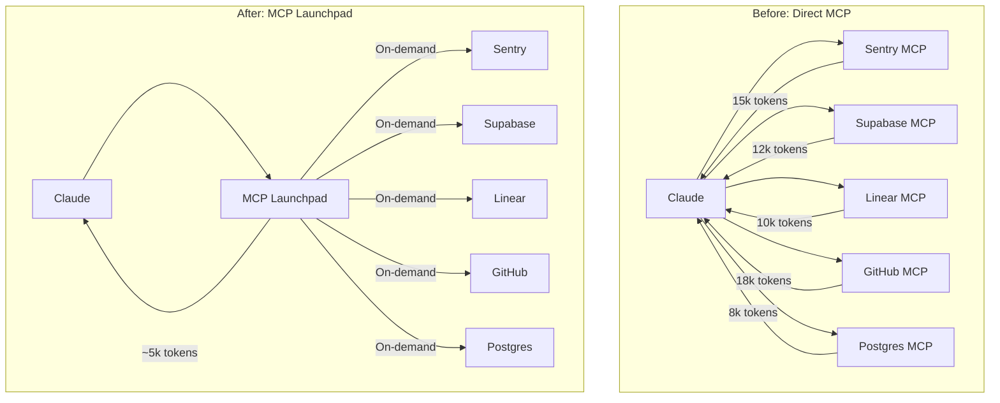

# MCP Launchpad Integration

MCP Launchpad provides a unified gateway for MCP servers that preserves context window space by loading tool schemas on-demand.

## The Problem

**MCP servers consume massive context.**

Each MCP server adds its tool schemas to Claude's context window:
- ~10-15k tokens per server
- 7 MCP servers = ~100k tokens
- That's 50% of Claude's context limit

This leaves less space for:
- Code you're working on
- Conversation history
- Error messages and logs
- Multi-step reasoning

---

## The Solution

MCP Launchpad (`mcpl`) acts as a unified gateway:

1. **Caches tool schemas locally** - Stored in ~/.cache/mcpl/
2. **On-demand loading** - Only fetches when tools are called
3. **Semantic search** - Find tools by description, not by server name
4. **Single entry point** - One tool instead of 50+

**Context savings:**
```
Before: ~100k tokens (7 MCP servers)
After:  ~5k tokens (mcpl gateway)
Saved:  ~95k tokens (47% of context window)
```

---

## Architecture



---

## Getting Started

### 1. Run Setup Command

```
/agileflow:configure
```

Then select **Infrastructure** → **MCP Launchpad**.

### 2. Install MCP Launchpad

If not already installed:

```bash
# Recommended: using uv (fast Python package manager)
uv tool install mcp-launchpad

# Alternative: using pip
pip install mcp-launchpad

# Verify installation
mcpl --version
```

### 3. Configure Servers

The setup wizard will ask which MCP servers you want:

| Server | Purpose |
|--------|---------|
| Sentry | Error tracking, issue search, stack traces |
| Supabase | Database queries, auth management, storage |
| Linear | Issue tracking, project management |
| GitHub | Repository access, PRs, code search |
| PostgreSQL | Direct database SQL queries |
| Slack | Team communication, channel messages |
| Filesystem | Extended file access beyond project |
| Brave Search | Web search with privacy |

### 4. Set Up Environment Variables

Copy the example file and fill in your credentials:

```bash
cp .env.mcp.example .env.mcp
```

Then edit `.env.mcp` with your API keys:

```bash
# Example for Sentry
SENTRY_AUTH_TOKEN=sntrys_xxxxx
SENTRY_ORG=my-organization
SENTRY_PROJECT=my-project
```

---

## Usage

### List Available Servers

```bash
mcpl list
```

Output:
```
Available MCP Servers:
  sentry     - Error tracking and monitoring
  supabase   - Database and auth platform
  github     - Repository operations
  linear     - Issue tracking
```

### Search for Tools

Find tools by description instead of navigating menus:

```bash
# Find error-related tools
mcpl search "error tracking"

# Find database tools
mcpl search "sql query"

# Find auth tools
mcpl search "authentication"
```

### Call a Tool

```bash
# Get recent Sentry issues
mcpl call sentry:list_issues --project=my-project --limit=10

# Search GitHub code
mcpl call github:search_code --query="authentication"
```

### Enable/Disable Servers

```bash
# Enable a server
mcpl enable postgres

# Disable a server
mcpl disable slack

# Check status
mcpl status
```

---

## Configuration Files

### mcp.json

The main configuration file for MCP servers:

```json
{
  "mcpServers": {
    "sentry": {
      "command": "npx",
      "args": ["-y", "@sentry/mcp-server-sentry"],
      "env": {
        "SENTRY_AUTH_TOKEN": "${SENTRY_AUTH_TOKEN}",
        "SENTRY_ORG": "${SENTRY_ORG}",
        "SENTRY_PROJECT": "${SENTRY_PROJECT}"
      }
    },
    "github": {
      "command": "npx",
      "args": ["-y", "@modelcontextprotocol/server-github"],
      "env": {
        "GITHUB_PERSONAL_ACCESS_TOKEN": "${GITHUB_PERSONAL_ACCESS_TOKEN}"
      }
    }
  }
}
```

### .env.mcp

Environment variables for authentication (NEVER commit this file):

```bash
SENTRY_AUTH_TOKEN=sntrys_xxxxx
SENTRY_ORG=my-org
SENTRY_PROJECT=my-project
GITHUB_PERSONAL_ACCESS_TOKEN=ghp_xxxxx
```

### .gitignore

Ensure secrets are protected:

```gitignore
# MCP Launchpad
.env.mcp
mcp.json
```

---

## Security Best Practices

### 1. Never Commit Secrets

- `.env.mcp` contains API keys - always in `.gitignore`
- Use `.env.mcp.example` for documentation
- Consider using 1Password or similar for team sharing

### 2. Minimal Permissions

When creating API tokens, use minimal scopes:

| Service | Recommended Scopes |
|---------|-------------------|
| GitHub | `repo`, `read:org` |
| Sentry | `project:read`, `event:read` |
| Supabase | Read-only access if possible |
| Slack | `channels:history`, `chat:write` |

### 3. Rotate Credentials

- Set reminders to rotate tokens quarterly
- Revoke immediately if accidentally exposed
- Use short-lived tokens where available

### 4. Audit Access

Check which servers are enabled and what they can access:

```bash
mcpl status --verbose
```

---

## Troubleshooting

### mcpl command not found

```bash
# Check if installed
which mcpl

# Reinstall if needed
uv tool install mcp-launchpad --force
```

### Server connection failed

1. Check environment variables are set:
   ```bash
   echo $SENTRY_AUTH_TOKEN
   ```

2. Verify token is valid:
   ```bash
   # For GitHub
   curl -H "Authorization: token $GITHUB_PERSONAL_ACCESS_TOKEN" \
     https://api.github.com/user
   ```

3. Check server logs:
   ```bash
   mcpl logs sentry
   ```

### Tool not found

```bash
# Refresh tool cache
mcpl refresh

# List all available tools
mcpl list --tools
```

---

## When to Use MCP Launchpad

| Scenario | Use MCP Launchpad? |
|----------|-------------------|
| Using 3+ MCP servers | Yes - significant context savings |
| Working on large codebases | Yes - preserve context for code |
| Single MCP server | Maybe - less benefit |
| Quick one-off tasks | No - direct use is fine |
| CI/CD environments | Maybe - depends on use case |

---

## Related Commands

| Command | Purpose |
|---------|---------|
| `/agileflow:configure` | Set up MCP Launchpad (select Infrastructure → MCP Launchpad) |
| `/agileflow:diagnose` | Check system health including MCP status |

## Related Resources

- [MCP Launchpad GitHub](https://github.com/nicobailon/mcp-launchpad)
- [MCP Protocol Documentation](https://modelcontextprotocol.io/)
- [Available MCP Servers](https://github.com/modelcontextprotocol/servers)
