# Smart Detection Architecture

This document describes the architecture of AgileFlow's Smart Detection system - the Contextual Feature Router that automatically recommends the right features at the right time.

---

## System Overview

<picture>
  <source media="(prefers-color-scheme: dark)" srcset="images/smart-detection-1.dark.svg">
  
</picture>

> Smart Detection pipeline: obtain-context.js gathers project data, smart-detect.js orchestrates signal extraction and lifecycle phase detection, 42 feature detectors run against signals filtered by phase, and recommendations are written to smart-detect.json for /babysit to act on.

---

## Key Files

| File | Purpose |
|------|---------|
| `scripts/obtain-context.js` | Entry point - gathers prefetched project data |
| `scripts/smart-detect.js` | Orchestrator - extracts signals, runs detectors, writes output |
| `scripts/lib/lifecycle-detector.js` | Workflow phase detection (5 phases) |
| `scripts/lib/signal-detectors.js` | 42 feature detector functions organized by phase |
| `docs/09-agents/smart-detect.json` | Output file with recommendations |

## How It Works

### Step 1: Signal Extraction

`extractSignals()` in smart-detect.js gathers structured signals from prefetched context data:

- **status.json** - Story statuses, blockers, epic progress
- **Git state** - Branch, changed files, diff stats, clean/dirty
- **session-state.json** - Active commands, session duration, failure count
- **package.json** - Available scripts (test, lint, build)
- **File system** - Config files, coverage data, CI setup
- **metadata.json** - Feature configuration, thresholds

### Step 2: Lifecycle Phase Detection

`detectLifecyclePhase()` in lifecycle-detector.js determines which workflow phase you're in:

| Phase | Condition |
|-------|-----------|
| **pre-story** | No active story, or story not started |
| **planning** | Story selected, plan mode active, no files changed |
| **implementation** | Story in-progress, files being modified |
| **post-impl** | Tests passing, changes still uncommitted |
| **pre-pr** | Tests pass, git clean, on feature branch |

Each phase also includes detectors from adjacent phases for smooth transitions.

### Step 3: Feature Detection

`runDetectorsForPhases()` in signal-detectors.js runs all relevant detectors:

- **10 pre-story** detectors (blockers, story-validate, choose, assign, board, sprint, batch, workflow, template, configure)
- **7 planning** detectors (impact, adr, research, baseline, council, multi-expert, validate-expertise)
- **11 implementation** detectors (verify, tests, audit, ci, deps, diagnose, debt, maintain, packages, deploy, serve)
- **9 post-impl** detectors (review, logic-audit, docs, changelog, metrics, retro, velocity, readme-sync, feedback)
- **2 pre-pr** detectors (pr, compress)

### Step 4: Filtering & Output

`filterRecommendations()` categorizes results into:
- **Immediate** - High priority, not yet offered
- **Available** - Medium/low priority or previously offered

`detectAutoModes()` checks for loop, visual, and coverage mode signals.

Results are written to `docs/09-agents/smart-detect.json` for `/babysit` to consume.

## Related Documentation

- [Babysit Mentor System](babysit-mentor-system.md)
- [Unified Context Gathering](unified-context-gathering.md)
- [PreCompact Context](precompact-context.md)
