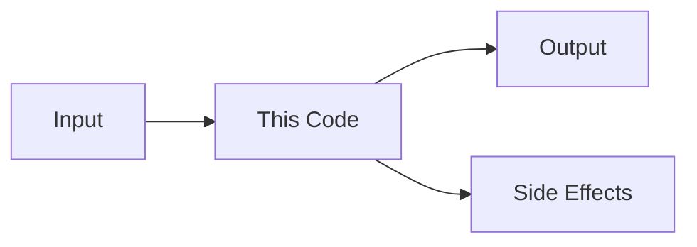

# /agileflow:learn:explain

Get a deep "why" explanation of code areas. Goes beyond what the code does to explain why it was written this way, what alternatives were considered, and what historical context shaped it.

---

## Quick Reference

```
/agileflow:learn:explain src/auth/middleware.ts             # Explain specific file
/agileflow:learn:explain handleCheckout                     # Explain a function
/agileflow:learn:explain "the caching layer"                # Explain a concept/area
/agileflow:learn:explain app/api/ DEPTH=thorough            # Thorough explanation
```

---

## How It Works

1. **Find the code** - Locate the target file, function, or feature
2. **Read the code** - Understand what it does
3. **Check git history** - Find when/why it was written or changed
4. **Analyze design decisions** - Explain the "why" behind the approach
5. **Surface alternatives** - What other approaches could have been used
6. **Present explanation** - Clear, educational explanation with context

---

## Step-by-Step Process

### STEP 1: Parse Arguments

```
TARGET = file path, function name, or feature description
DEPTH = quick (3-5 min read) or thorough (10-15 min read)
```

### STEP 2: Find and Read Code

1. If file path: read the file directly
2. If function name: search codebase for the function
3. If feature description: use `Explore` agent to find relevant files

### STEP 3: Analyze Git History

```bash
git log --follow --oneline {file}        # See file history
git log -p --follow -S "{function}" -- . # Find when function was added/changed
git blame {file}                          # See who wrote each line and when
```

### STEP 4: Generate Explanation

Structure the explanation:

```markdown
## What This Code Does

{Clear explanation of the code's purpose and behavior}

## Why It's Written This Way

{Design reasoning - what constraints or requirements led to this approach}

### Historical Context
{Git history insights - when it was written, major changes, why changes were made}

### Design Decisions
| Decision | Choice Made | Why | Alternative Considered |
|----------|-------------|-----|----------------------|
| {decision} | {choice} | {reasoning} | {what else could have been done} |

## How It Connects

{Data flow diagram showing where this code fits in the system}



## Key Concepts

| Concept | Explanation |
|---------|-------------|
| {term} | {what it means in this context} |

## Gotchas

{Non-obvious behaviors, edge cases, or things to be careful about}
```

### STEP 5: Offer Follow-Up

```
Explanation complete for {target}.

Options:
- Explain a related area
- Tour the broader system this belongs to
- See similar patterns elsewhere in the codebase
- Done
```

---

## Related Commands

- `/agileflow:learn:tour` - Guided codebase walkthrough
- `/agileflow:learn:patterns` - Design patterns catalog
- `/agileflow:learn:glossary` - Domain terminology
- `/agileflow:context:full` - Full project context
