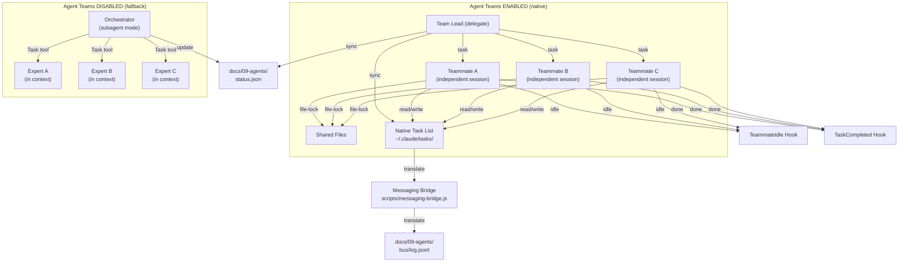

# /agileflow:team:guide

Agent Teams migration guide, architecture reference, and troubleshooting for Claude Code's native multi-agent coordination.

---

## Overview

AgileFlow supports Claude Code's native Agent Teams for coordinating multiple specialized agents. This system runs alongside the existing subagent model:

- **Agent Teams ENABLED**: Teammates run as independent sessions with shared task lists and file-locking
- **Agent Teams DISABLED**: Orchestrator subagent model continues to work identically

Both modes produce the same results through different mechanisms. Choose based on your environment and use case.

---

## Quick Start

### Check if Agent Teams is Available

```bash
node -e "console.log(JSON.stringify({ agentTeams: !!process.env.CLAUDE_CODE_EXPERIMENTAL_AGENT_TEAMS }))"
```

### Enable Agent Teams

```bash
export CLAUDE_CODE_EXPERIMENTAL_AGENT_TEAMS=1
```

Or add to `.env`:
```
CLAUDE_CODE_EXPERIMENTAL_AGENT_TEAMS=1
```

### Start a Team

```
/agileflow:team:start fullstack
```

View available templates:
```
/agileflow:team:list
```

---

## Available Team Templates

| Template | Lead | Teammates | Best For |
|----------|------|-----------|----------|
| **fullstack** | team-lead | api, ui, testing | Full-stack feature development with integrated testing |
| **code-review** | team-lead | code-reviewer, security, performance | Comprehensive code review and quality gates |
| **builder-validator** | team-lead | api+api-validator, ui+ui-validator | Paired builders and validators for each domain |
| **logic-audit** | logic-consensus | 4 logic analyzers | Deep analysis of complex logic with multiple perspectives |

Each template defines:
- Team composition (lead + teammates)
- Quality gates (tests, lint, types, coverage)
- Task synchronization rules
- Fallback behavior when Agent Teams is disabled

---

## Architecture

### Dual-Mode System

**Native Agent Teams Mode (Enabled)**:
```
Team Lead (delegate mode, in this session)
├─ Teammate A (independent session, file-locked)
├─ Teammate B (independent session, file-locked)
├─ Teammate C (independent session, file-locked)
└─ Shared task list (native .claude/tasks/)
```

**Orchestrator Subagent Mode (Disabled)**:
```
Orchestrator (in this session)
├─ Task → Expert A (within context, /babysit)
├─ Task → Expert B (within context, /babysit)
├─ Task → Expert C (within context, /babysit)
└─ AgileFlow bus messaging (docs/09-agents/bus/log.jsonl)
```

### Quality Gate Hooks

Two hooks enforce quality standards:

**1. TeammateIdle Hook** (`scripts/teammate-idle-gate.js`)
- Runs when a teammate finishes work
- Exit code semantics:
  - `0` = Allow teammate to go idle
  - `2` = Block idle (display quality gate failures)
- Checks: Tests, linting, type checking, code coverage
- Configuration: Via `/agileflow:configure → Infrastructure → Quality Gates`

**2. TaskCompleted Hook** (`scripts/task-completed-gate.js`)
- Runs when a builder marks a task complete
- Exit code semantics:
  - `0` = Allow task completion
  - `2` = Block until validator approves
- Checks: Validator approval, test coverage threshold
- Configuration: Via `/agileflow:configure → Infrastructure → Quality Gates`

### Task Synchronization

Tasks are bidirectionally synchronized:

| System | Location | Purpose | Owner |
|--------|----------|---------|-------|
| **Native Task List** | `~/.claude/tasks/` | Source of truth for teammates | Claude Code |
| **AgileFlow Status** | `docs/09-agents/status.json` | Persistent project state | AgileFlow |

**Sync Direction**:
1. Native task list (write-through) - teammates read/write here
2. AgileFlow status.json - synced after each operation
3. On team cleanup - final states reconcile back to status.json

**Lock Semantics**:
- While task is in `~/.claude/tasks/`, file is locked (teammate exclusive)
- After teammate finishes, lock released and task syncs to status.json
- Status.json remains source of truth for historical record

### Messaging Bridge

The messaging bridge (`scripts/messaging-bridge.js`) translates between:
- **AgileFlow bus** (`docs/09-agents/bus/log.jsonl`) - internal messaging
- **Claude Code inter-agent messaging** - native teammate communication

All messages flow through both systems for full observability.

**Supported message types**:
- Task assignments
- Status updates
- Quality gate results
- Teammate idle notifications
- Error reports

---

## Migration: From Subagent to Agent Teams

### When to Migrate

**Migrate to Agent Teams if**:
- You want completely independent teammate sessions (better isolation)
- You prefer Claude Code's native task UI over AgileFlow's internal bus
- You need file-locking (prevent concurrent modifications)
- Your teammates are long-running (avoid context accumulation)

**Stay with Subagent mode if**:
- Agent Teams is not available in your Claude Code version
- You prefer the orchestrator controlling all tasks directly
- You want to keep everything within a single Claude Code session
- You prefer AgileFlow's existing messaging model

### Migration Steps

#### Step 1: Set Environment Variable

```bash
export CLAUDE_CODE_EXPERIMENTAL_AGENT_TEAMS=1
```

Verify it's set:
```bash
echo $CLAUDE_CODE_EXPERIMENTAL_AGENT_TEAMS
```

#### Step 2: Load Feature Flags

AgileFlow auto-detects Agent Teams availability:

```bash
node -e "const ff = require('./.agileflow/lib/feature-flags'); console.log(ff.isAgentTeamsEnabled())"
```

#### Step 3: Update Team Commands

Your existing `/agileflow:team:*` commands automatically use Agent Teams when enabled.

Check your current mode:
```
/agileflow:team:status
```

Should show:
```
Agent Teams Mode: ENABLED (native Claude Code Agent Teams)
Available templates: fullstack, code-review, builder-validator, logic-audit
```

#### Step 4: Test with a Team

Start with the smallest template first:

```
/agileflow:team:start code-review
```

This spawns just 3 teammates (reviewer, security, performance) for minimal complexity.

#### Step 5: Monitor Quality Gates

During the test run, observe:
- Teammates spawning correctly
- Tasks appearing in `~/.claude/tasks/`
- Quality gates running after each teammate's work
- Final status syncing back to `docs/09-agents/status.json`

#### Step 6: Gradual Rollout

Once verified, migrate to larger templates:
```
/agileflow:team:start builder-validator   # 2 builders + 2 validators
/agileflow:team:start fullstack           # API + UI + Testing
```

---

## Configuration

### Quality Gates Configuration

Access via: `/agileflow:configure → Infrastructure → Quality Gates`

**Available gates**:
- `tests`: Require all tests to pass before teammate goes idle (required/optional)
- `lint`: Require linting to pass (required/optional)
- `types`: Require TypeScript type checking to pass (required/optional)
- `coverage`: Require minimum code coverage percentage (e.g., 80%)

**Example configuration** (in `.agileflow/config.yaml`):
```yaml
quality_gates:
  teammate_idle:
    tests: required
    lint: required
    types: optional
    coverage: 75
  task_completed:
    validator_approval: required
    test_coverage: 80
```

### Custom Team Templates

Create new templates in `.agileflow/teams/<name>.json`:

```json
{
  "name": "my-custom-team",
  "description": "Custom team for my project",
  "lead": "team-lead",
  "delegate_mode": true,
  "teammates": [
    {
      "agent": "agileflow-api",
      "role": "Backend Developer",
      "domain": "backend",
      "skills": ["REST API", "Database Design"]
    },
    {
      "agent": "agileflow-ui",
      "role": "Frontend Developer",
      "domain": "frontend",
      "skills": ["React", "Tailwind CSS"]
    }
  ],
  "quality_gates": ["tests", "lint", "types"],
  "task_dependencies": {
    "api-build": ["ui-build"],
    "testing": ["api-build", "ui-build"]
  }
}
```

**Template schema**:
- `name`: Template identifier (used in `/agileflow:team:start`)
- `description`: Human-readable description
- `lead`: Team lead agent ID
- `delegate_mode`: Whether lead operates in delegate mode (default: true)
- `teammates`: Array of teammate definitions
  - `agent`: Agent ID (e.g., agileflow-api, agileflow-ui)
  - `role`: Human-readable role
  - `domain`: Domain area (backend, frontend, testing, etc.)
  - `skills`: Array of skills/specialties
- `quality_gates`: Which gates apply to this team
- `task_dependencies`: Optional task ordering constraints

---

## Fallback Behavior

When Agent Teams is **NOT** enabled:

| Command | Behavior |
|---------|----------|
| `/agileflow:team:start <template>` | Falls back to orchestrator with warning |
| `/agileflow:team:status` | Shows "DISABLED (using orchestrator subagent mode)" |
| `/agileflow:team:list` | Lists available templates but with fallback notice |
| Quality gates | Still run via ralph-loop Stop hook |

**Example fallback output**:
```
⚠️  Agent Teams is not enabled
    Using orchestrator subagent model for team coordination

To enable native Agent Teams:
  export CLAUDE_CODE_EXPERIMENTAL_AGENT_TEAMS=1

Falling back to /babysit orchestrator mode...
```

The orchestrator then uses the existing `/babysit` workflow to coordinate agents internally.

---

## Troubleshooting

### Team Won't Start

**Problem**: `/agileflow:team:start fullstack` fails or shows "no templates found"

**Solutions**:
1. Verify Agent Teams is enabled:
   ```bash
   echo $CLAUDE_CODE_EXPERIMENTAL_AGENT_TEAMS
   ```
   Should output: `1`

2. Check templates are installed:
   ```bash
   ls -la .agileflow/teams/
   ```
   Should show: `fullstack.json`, `code-review.json`, etc.

3. Verify feature flags module is accessible:
   ```bash
   node -e "const ff = require('./.agileflow/lib/feature-flags'); console.log('OK')"
   ```

4. If still failing, fall back to subagent mode:
   ```
   /agileflow:babysit
   ```

### Quality Gate Blocks Work

**Problem**: Teammate gets blocked with "Quality gates failed"

**Solutions**:
1. Check which gate failed:
   ```bash
   cat docs/09-agents/session-state.json | jq '.quality_gate_results'
   ```

2. Run the failing gate manually to debug:
   ```bash
   node scripts/teammate-idle-gate.js --verbose
   ```

3. Fix the issue (e.g., run tests, fix lint errors):
   ```bash
   npm test
   npm run lint:fix
   ```

4. Teammate will automatically resume once gates pass

5. Temporarily disable a gate for debugging:
   ```
   /agileflow:configure → Infrastructure → Quality Gates
   ```
   Set problematic gate to `optional`

### Tasks Not Syncing

**Problem**: Tasks in `~/.claude/tasks/` don't appear in `status.json`

**Solutions**:
1. Check task sync status:
   ```bash
   node scripts/lib/task-sync.js status
   ```

2. Manually sync tasks:
   ```bash
   node scripts/lib/task-sync.js sync
   ```

3. Verify `status.json` exists and is readable:
   ```bash
   ls -la docs/09-agents/status.json
   ```

4. Check for sync errors:
   ```bash
   cat docs/09-agents/session-state.json | jq '.sync_errors'
   ```

5. If corrupted, reset status.json:
   ```bash
   git checkout docs/09-agents/status.json
   node scripts/lib/task-sync.js sync
   ```

### Messaging Bridge Not Working

**Problem**: Messages don't appear in `docs/09-agents/bus/log.jsonl`

**Solutions**:
1. Check bridge status:
   ```bash
   node scripts/messaging-bridge.js status
   ```

2. Read recent messages:
   ```bash
   node scripts/messaging-bridge.js read --limit=10
   ```

3. Test bridge manually:
   ```bash
   node scripts/messaging-bridge.js send --message="Test message" --source="debugging"
   ```

4. Check bus file permissions:
   ```bash
   ls -la docs/09-agents/bus/log.jsonl
   ```
   Should be readable/writable by all

5. If bridge is stuck, restart it:
   ```
   /agileflow:team:stop
   /agileflow:team:status
   /agileflow:team:start fullstack
   ```

### Teammate Sessions Crash

**Problem**: A teammate session dies unexpectedly

**Solutions**:
1. Check teammate logs:
   ```bash
   ls -la ~/.claude/sessions/
   ```
   Each teammate has a session directory with logs

2. View teammate error log:
   ```bash
   cat ~/.claude/sessions/teammate-api/error.log
   ```

3. Check if it's a resource issue:
   ```bash
   top
   ps aux | grep node
   ```

4. Restart the team:
   ```
   /agileflow:team:stop
   /agileflow:team:start fullstack
   ```

5. If persistent, fall back to subagent mode:
   ```
   /agileflow:babysit
   ```

---

## Performance & Optimization

### When to Use Each Mode

**Agent Teams (Native)**:
- ✅ Long-running tasks (avoid context bloat)
- ✅ Large codebases (file-locking prevents conflicts)
- ✅ Parallel work (teammates run independently)
- ✅ External integrations (native task UI)
- ❌ Very short sessions (overhead not justified)
- ❌ When Agent Teams not available

**Subagent Orchestrator**:
- ✅ Short bursts of work (fast startup)
- ✅ Simple teams (< 3 teammates)
- ✅ When Agent Teams not available
- ✅ Debugging (everything in one session)
- ❌ Long-running projects (context accumulates)
- ❌ Parallel work (sequential only)

### Context Management

**Agent Teams**:
- Each teammate has its own context (independent)
- Context grows only within each teammate's session
- Completed tasks don't accumulate in context

**Subagent Mode**:
- All teammates' context in orchestrator's session
- Context grows linearly with each task
- Risk of compaction ("PreCompact" hook runs frequently)

### Monitoring Performance

Check session metrics:

```bash
cat docs/09-agents/session-state.json | jq '.metrics'
```

Key metrics:
- `session_duration_seconds`: How long team is running
- `tasks_completed`: Total tasks done
- `tasks_per_second`: Throughput
- `average_task_time_seconds`: Performance per task
- `context_tokens_used`: Token consumption
- `quality_gates_blocks`: How many times gates blocked

---

## Related Commands

- `/agileflow:team:start` - Start a team from a template
- `/agileflow:team:list` - List available templates
- `/agileflow:team:status` - Show current team status
- `/agileflow:team:stop` - Stop running team
- `/agileflow:babysit` - Subagent orchestrator mode (fallback)
- `/agileflow:configure` - Manage quality gates and hooks
- `/agileflow:status` - Show story status (works with both modes)

---

## Best Practices

### 1. Start Small

Test with the `code-review` template (3 teammates) before scaling to `fullstack` (4 teammates).

### 2. Monitor Quality Gates

Quality gates prevent bugs but can block progress. Balance:
- **Strict**: Catch all issues, but slow development
- **Lenient**: Fast, but miss quality issues
- **Recommended**: tests (required), lint (optional), types (optional), coverage (70%)

### 3. Use Task Dependencies

For complex teams, define task ordering in templates:
```json
"task_dependencies": {
  "api-build": [],
  "ui-build": [],
  "testing": ["api-build", "ui-build"]
}
```

This prevents testing from starting until both API and UI are ready.

### 4. Backup Status Before Large Runs

Before starting a big team initiative:
```bash
cp docs/09-agents/status.json docs/09-agents/status.json.backup
```

If anything goes wrong, restore:
```bash
mv docs/09-agents/status.json.backup docs/09-agents/status.json
```

### 5. Document Custom Templates

If you create custom templates, document them:
```json
{
  "name": "my-custom-team",
  "description": "Built for [reason]. Teammates: [list]. Testing priority: [yes/no]"
}
```

### 6. Regular Audits

Weekly, check:
- Quality gate statistics
- Which gates block most often
- Adjust gate strictness accordingly

---

## Architecture Diagram



> This diagram shows how Agent Teams mode (top) uses independent sessions with file-locking and native task lists, while disabled mode (bottom) uses the orchestrator with subagents in shared context. Quality gates run in both modes. A messaging bridge translates between native and AgileFlow messaging.

---

## FAQ

**Q: Can I switch between modes mid-session?**
A: No. Set the environment variable before starting your team. To switch, stop the team, set the env var, and start a new team.

**Q: Do my existing stories work with Agent Teams?**
A: Yes. Stories in `status.json` are automatically synced with native tasks. Both modes read/write the same `status.json`.

**Q: What if a teammate crashes?**
A: The team continues, but that teammate's task gets re-assigned. If critical, use `/agileflow:team:stop` and restart.

**Q: How do quality gates prevent bad code?**
A: Gates run before teammates go idle. If tests fail, the gate blocks idle (exit code 2), and teammate must fix the issue.

**Q: Can I use custom agents in teams?**
A: Yes. Create a custom template in `.agileflow/teams/<name>.json` and reference your custom agent in the `teammates` array.

**Q: Is there a cost difference between modes?**
A: Agent Teams spawns more Claude Code instances (more API calls) but provides better isolation. Subagent mode uses one session but accumulates context.

**Q: How do I know if my code has bugs?**
A: Quality gates catch many issues (tests, lint, types, coverage). But for logic bugs, use the `logic-audit` template which spawns 4 logic analyzers.

---

## See Also

- **Agent Teams Setup**: `/agileflow:team:start`
- **View Team Status**: `/agileflow:team:status`
- **List Templates**: `/agileflow:team:list`
- **Stop Team**: `/agileflow:team:stop`
- **Subagent Mode**: `/agileflow:babysit`
- **Quality Configuration**: `/agileflow:configure`
