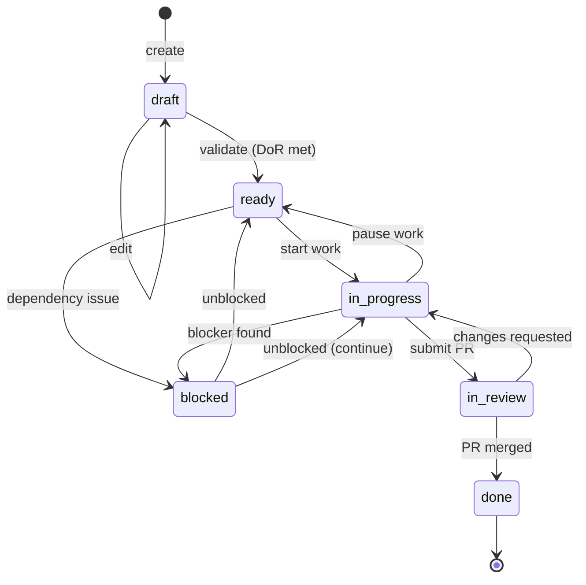

# Story Lifecycle

This document describes how stories transition through different states in AgileFlow.

---

## State Diagram



---

## Story States

| State | Description | Next Actions |
|-------|-------------|--------------|
| **draft** | Story created but not ready for work | Validate, add AC, set estimate |
| **ready** | Definition of Ready (DoR) met | Start work, assign owner |
| **in-progress** | Actively being worked on | Complete, submit PR, or pause |
| **blocked** | Waiting on external dependency | Resolve blocker, escalate |
| **in-review** | Pull request submitted | Review, approve, merge |
| **done** | Work complete and merged | Archive, celebrate |

---

## State Transitions

### draft → ready

**Trigger**: Story passes Definition of Ready (DoR)

**DoR Checklist**:
- [ ] Clear acceptance criteria (Given/When/Then)
- [ ] Estimate provided
- [ ] Dependencies identified
- [ ] Owner assigned
- [ ] Epic linked

**Command**: `/agileflow:story-validate STORY=US-XXXX`

---

### ready → in-progress

**Trigger**: Developer starts work

**Actions**:
1. Update status.json: `status: "in-progress"`
2. Set phase to `execute`
3. Log to bus/log.jsonl

**Command**: `/agileflow:status STORY=US-XXXX STATUS=in-progress`

---

### in-progress → in-review

**Trigger**: Pull request created

**Actions**:
1. Update status.json: `status: "in-review"`
2. Set phase to `audit`
3. Add PR link
4. Log to bus/log.jsonl

**Command**: `/agileflow:status STORY=US-XXXX STATUS=in-review PR=<url>`

---

### in-review → done

**Trigger**: PR merged to main

**Actions**:
1. Update status.json: `status: "done"`
2. Set phase to `complete`
3. Log completion to bus/log.jsonl
4. Auto-archive after 7 days

**Command**: `/agileflow:status STORY=US-XXXX STATUS=done`

---

### → blocked

**Trigger**: External dependency or blocker found

**Actions**:
1. Update status.json: `status: "blocked"`
2. Add blocker reason
3. Log to bus/log.jsonl
4. Notify dependent teams

**Command**: `/agileflow:status STORY=US-XXXX STATUS=blocked SUMMARY="Waiting on API keys"`

---

## Phase Mapping

Stories have both a **status** and a **phase**. Phases group statuses for high-level tracking:

| Status | Phase | Description |
|--------|-------|-------------|
| draft | plan | Planning and scoping |
| ready | plan | Ready for planning/assignment |
| in-progress | execute | Active development |
| blocked | execute | Blocked but in execute phase |
| in-review | audit | Quality review |
| done | complete | Work finished |

---

## WIP Limits

AgileFlow enforces Work-In-Progress (WIP) limits to prevent overload:

- **Per Agent**: Max 2 stories in `in-progress` + `in-review`
- **Per Epic**: Configurable, typically 5-10 concurrent stories

**Violation handling**:
```
⚠️ WIP Limit Exceeded

AG-UI has 3 stories in progress (limit: 2):
  - US-0042: Login Form
  - US-0043: Profile Page
  - US-0044: Dashboard

Complete or pause a story before starting new work.
```

---

## Lifecycle in status.json

```json
{
  "stories": {
    "US-0042": {
      "id": "US-0042",
      "title": "Login Form with Validation",
      "epic": "EP-0010",
      "owner": "AG-UI",
      "status": "in-progress",
      "phase": "execute",
      "estimate": "2h",
      "deps": ["US-0041"],
      "created": "2026-01-20T10:00:00Z",
      "updated": "2026-01-21T14:30:00Z",
      "history": [
        {"status": "draft", "ts": "2026-01-20T10:00:00Z"},
        {"status": "ready", "ts": "2026-01-20T11:00:00Z"},
        {"status": "in-progress", "ts": "2026-01-21T09:00:00Z"}
      ]
    }
  }
}
```

---

## Bus Messages

State transitions are logged to `docs/09-agents/bus/log.jsonl`:

```jsonl
{"ts":"2026-01-21T09:00:00Z","type":"status","from":"AG-UI","to":"ALL","story":"US-0042","status":"in-progress","text":"Started work on login form"}
{"ts":"2026-01-21T14:30:00Z","type":"status","from":"AG-UI","to":"ALL","story":"US-0042","status":"in-review","pr":"https://github.com/.../pull/42"}
{"ts":"2026-01-21T16:00:00Z","type":"status","from":"AG-UI","to":"ALL","story":"US-0042","status":"done","text":"PR merged"}
```

---

## Related Commands

| Command | Purpose |
|---------|---------|
| `/agileflow:story` | Create new story |
| `/agileflow:status` | Update story status |
| `/agileflow:board` | View kanban board |
| `/agileflow:blockers` | View blocked stories |
| `/agileflow:story-validate` | Validate DoR |

---

## Best Practices

1. **Keep stories small**: 1-3 days of work maximum
2. **Update status promptly**: Reflect actual work state
3. **Document blockers**: Include reason and expected resolution
4. **Respect WIP limits**: Complete before starting new
5. **Use phase handoffs**: Capture context at transitions
